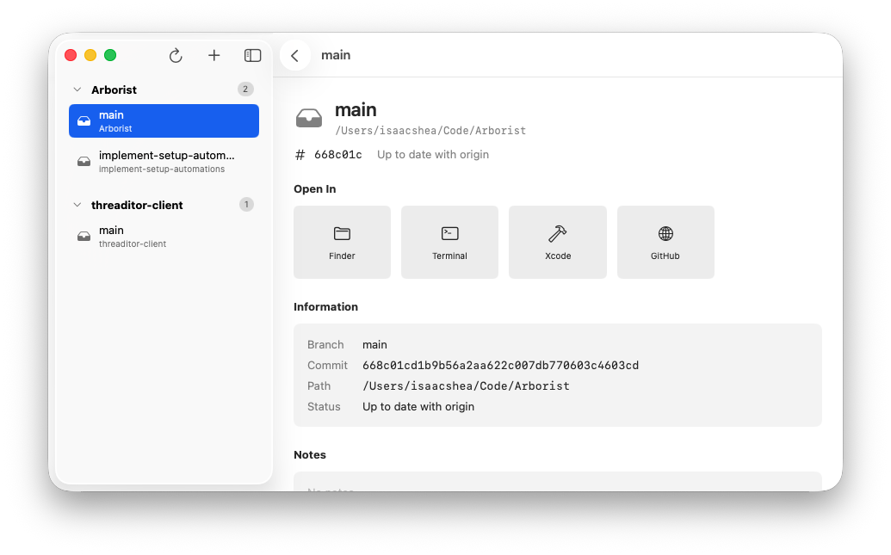

  

<h1 align="center">Arborist - Git Worktree Manager</h1>

Git worktrees are brilliantly powerful for both humans and AI agents, but accessing them entirely via CLI can be cumbersome. Enter Arborist, a native macOS app that makes working with worktrees simple.

  

  <a href="https://github.com/zaccomode/Arborist/releases/latest"> Download now! </a>

## Key Features
- **Create & manage git worktrees:** create, view, and delete git worktrees across many repositories, all in one place. Arborist also keeps track of stale branches and prunable worktrees.
- **Open Presets:** quickly open your worktrees in Finder, Terminal, VScode, and more. Arborist comes pre-loaded with regular presets, but you can create your own - open applications, URLs, or even run Bash scripts specific to your worktree.
  - Open Presets can be set at an app level, and overridden per-repository.
- **Setup Automations:** automatically execute setup commands (e.g. npm install) when creating a new worktree. This can be as simple as a single line, or bash scripts as complex as you need.
  - Like Open Presets, these commands support substituting worktree information at runtime, allowing you to create commands tailored to your workspace.
